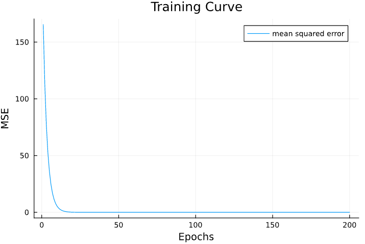

# A Simple Neural Network in JAC

In this post, I'll be using JAC to perform a Linear Regression on a synthetic dataset.

## Importing Packages

```julia
# Importing Packages Needed
using jac
using Plots
```

## Synthetic Dataset

```julia
# Generating Synthetic Data
x = range(-5, 5, 50); # X range
y = range(-5, 5, 50); # Y range

grid = Iterators.product(x, y); # Grid Operator
X = reshape(collect.(grid), 50*50); # Getting Grid points
X = reduce(hcat,X)' # Reshaping grid points to a Matrix


W = rand(2,1) # True Weights
b = rand(1,1) # True Bias

Y = X * W .+ b; # True Labels
```

## Linear Regression

```julia
X = Tensor(Array(X)); # Converting Arrays to Tensors
Y = Tensor(Array(Y)); # Converting Arrays to Tensors

EPOCHS = 500;

W_init = Tensor(rand(2,1)*2) # Initial Weights
b_init = Tensor(zeros(1,1)) # Initial Bias

MSE = zeros(EPOCHS);
for i = 1:EPOCHS # Iterations for Gradient Descent
    Y_pred = X*W_init + b_init; # Prediction
    
    mse = sum((Y_pred - Y)^2)/size(X)[1]; # Mean Squared Error
    println("Epoch $i; MSE: $(mse.val)")
    MSE[i] = mse.val

    # Updating Weights and Bias
    gradients = jac.grad(mse);

    W_init.val = W_init.val - 0.01*gradients[W_init];
    b_init.val = b_init.val - 0.01*gradients[b_init];
end
```

Let's now plot the Mean Squared Error curve with respect to epochs.

```julia
plot(MSE, xlabel="Epochs", ylabel="MSE", title="Training Curve", labels="mean squared error")
```
