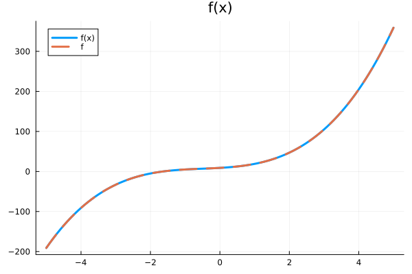
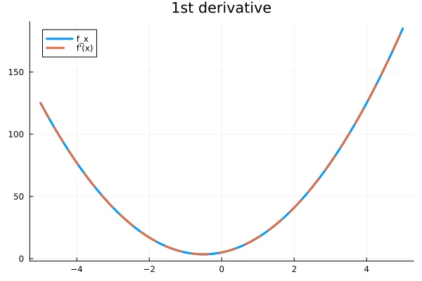
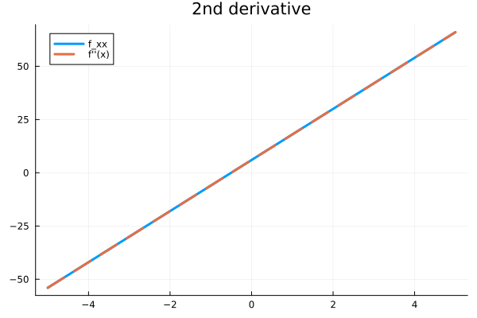
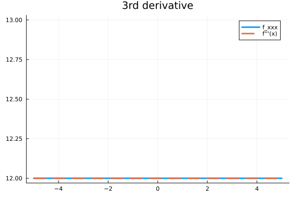

# Introduction to Reverse Mode Automatic Differentiation on Scalars

## Problem Statement
Differentiate $f(x)=2x^3 + 3x^2 + 5x + 9$ automatically for $x \in [-5, 5]$.

## Solution
Import `jac` library.
```julia
using jac
```

Next step is to define the above mentioned cubic polynomial as a function.
```julia
f(x::Tensor) = 2*x^3 + 3*x^2 + 5*x + 9
```
 
Forward pass (or computation graph generation) is just about executing the function in desired range of $x$ values and gradient at that point can be computed simultaneously using `autograd`.
```julia
# Define range
X = range(-5, 5, 100) 
# Empty lists to store value and gradients at each x value
Y = []          # Evaluations
dY_dX = []      # 1st order derivative
d2Y_dX2 = []    # 2nd order derivative
d3Y_dX3 = []    # 3rd order derivative

# Looping over each x value
for x_val in X
    # Converting point to Tensor
    x = Tensor(x_val) 

    # Evaluating the function
    y = f(x)
    append!(Y, y.val)
    
    # 1st order derivative
    dy_dx = autograd(y)[x]
    append!(dY_dX, dy_dx.val)
    
    # 2nd order derivative
    d2y_dx2 = autograd(dy_dx)[x]
    append!(d2Y_dX2, d2y_dx2.val)

    # 3rd order derivative
    d3y_dx3 = autograd(d2y_dx2)[x]
    append!(d3Y_dX3, d3y_dx3.val)
end
```

Now I have everything I need. To verify the results I'll plot them against analytical solutions.
```julia
# f(x)
f(x) = 2*x.^3 .+ 3*x.^2 .+ 5*x .+ 9

# 1st order analytical derivative
f_x(x) = 6*x.^2 .+ 6*x .+ 5

# 2nd order analytical derivative
f_xx(x) = 12*x .+ 6

# 3rd order analytical derivative
f_xxx(x) = ones(size(x)) .* 12
```

```julia
using Plots
```

- $f(x)$ plotted:
```julia
# f(x) plotted
plot([X, X], [f(X), Y], label=["f(x)" "f"], linewidth=3, ls=[:solid :dash], title="f(x)")
```


- $f'(x)$ plotted:
```julia
# f'(x) plotted
plot([X, X], [f_x(X), dY_dX], label=["f_x" "f'(x)"], linewidth=[3 3], ls=[:solid :dash], title="1st derivative")
```


- $f''(x)$ plotted:
```julia
# f''(x) plotted
plot([X, X], [f_xx(X), d2Y_dX2], label=["f_xx" "f''(x)"], linewidth=[3 3], ls=[:solid :dash], title="2nd derivative")
```


- $f'''(x)$ plotted:
```julia
# f'''(x) plotted
plot([X, X], [f_xxx(X), d3Y_dX3], label=["f_xxx" "f'''(x)"], linewidth=[3 3], ls=[:solid :dash], title="3rd derivative")
```

